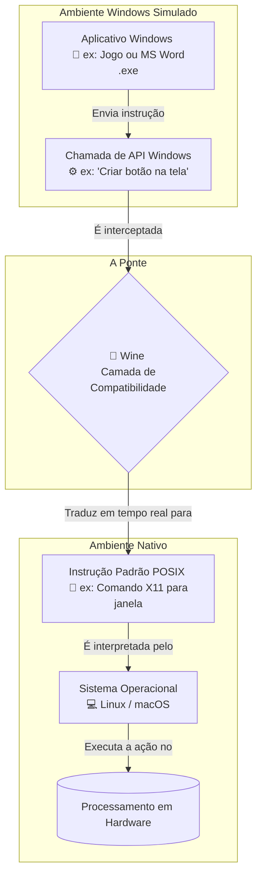

---
tags:
  - wine
  - open-source
  - linux
---
## Conceito Principal
* O Wine é uma camada de compatibilidade que torna possível executar programas e jogos do Windows em qualquer sistema operacional do tipo Unix, como o Linux e o macOS.
* A sigla Wine significa "Wine Is Not an Emulator" (Wine Não é um Emulador), refletindo o fato de que ele traduz as instruções do sistema em vez de emular o hardware.
* Ele é um software livre, distribuído sob os termos da licença GNU LGPL.
* O Wine é ativamente desenvolvido como um projeto de código aberto.

## Como funciona?
* Em sua base, o Wine é uma implementação própria da biblioteca da Interface de Programação de Aplicativos (API) do Windows.
* Ele funciona como uma ponte direta entre o programa do Windows e o sistema Linux.
* Em vez de emular um ambiente Windows completo, o Wine traduz as chamadas de sistema do Windows para chamadas compatíveis com o padrão POSIX (usadas pelo Linux).
* Por exemplo, se um aplicativo pedir para criar um campo de texto ou um botão, o Wine converte instantaneamente essa instrução em um comando equivalente do Linux, utilizando o protocolo padrão X11 para o gerenciador de janelas.
* A estrutura do Wine consiste em um carregador de programas (responsável por carregar e executar os arquivos binários do Windows) em conjunto com uma biblioteca nativa chamada Winelib.

## Funcionalidades e Suporte
* O Wine oferece suporte para a execução de uma ampla gama de arquiteturas, incluindo programas em DOS, Win16 (como o Windows 3.1), Win32 e Win64.
* Ele traz suporte integrado ao DirectX, recurso fundamental para o funcionamento de jogos.
* Possui ótimo suporte para vários drivers de som, incluindo as tecnologias ALSA e OSS.
* Oferece suporte para diversos tipos de hardware e comunicação, incluindo modems, dispositivos seriais, redes TCP/IP via Winsock e suporte a scanners (através da interface ASPI).
* Permite a impressão de documentos utilizando um driver de interface PostScript que se comunica com os serviços de impressão padrão do Unix.
* Permite o uso opcional de arquivos DLL externos originais fornecidos pelo próprio Windows.

## Desenvolvimento com a Winelib
* Se um desenvolvedor tiver acesso ao código-fonte de um aplicativo do Windows, ele pode utilizar o Wine para recompilar o programa em um formato que o Linux processe com mais facilidade.
* Essa tarefa é feita através da biblioteca Winelib, que pode ser usada para portar código do Windows diretamente para arquivos executáveis nativos do Unix.