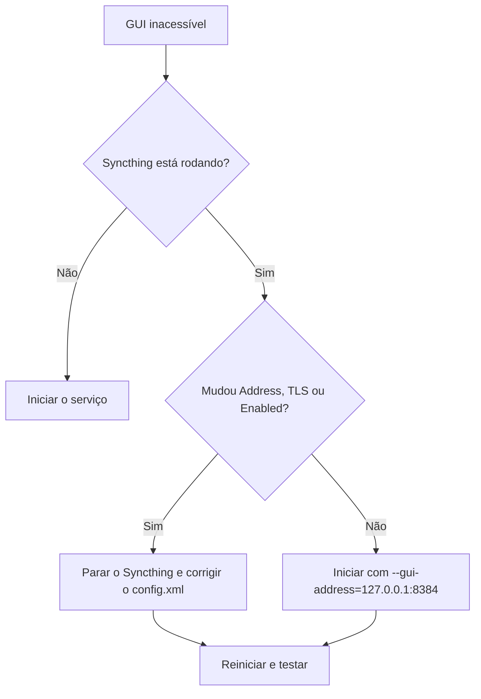

---
tags:
  - syncthing
  - sincronização
  - funcionalidades
  - android
  - computador
  - arquivos
  - Syncthing_GUI_avançada
  - Syncthing_config_gui
  - documentacao
  - seguranca
  - gui
---
Existem diversas formas de personalização no Syncthing. Mas antes de começarmos esse tópico, tome muito cuidado com o que vai mexer, porque você está literalemnte mexendo em coisas que podem quebrar toda a aplicação e sincronização dos seus arquivos. Dito isso, podemos prosseguir.

--- 
# Syncthing: configuração avançada da interface gráfica

> [!abstract] Resumo Esta nota documenta cada campo da seção **Interface gráfica** em _Ações → Configurações avançadas_ do [[Syncthing - O que é e suas principais funcionalidades]]. Para cada opção há a função, o valor padrão e **o que acontece se você alterar**.

> [!info] Contexto Essa tela é a edição direta do elemento `<gui>` do arquivo `config.xml`, o mesmo que a [[REST API do Syncthing]] expõe em `/rest/config/gui`. Só o campo **Theme** é visual. Os demais controlam rede, autenticação, sessão e segurança HTTP.

---

## Como acessar

1. Abra a GUI (por padrão `http://127.0.0.1:8384`).
2. Clique em **Ações → Configurações avançadas**.
3. Expanda a seção **Interface gráfica**.
4. Altere o campo e clique em **Salvar**.

> [!warning] Cuidado A própria tela avisa que uma configuração incorreta pode causar danos aos dados e tornar o Syncthing inoperante. Faça backup do `config.xml` antes de mexer.

> [!note] Reinício Mudanças em **Address**, **Enabled**, **Use TLS** e **Unix Socket Permissions** normalmente exigem reiniciar o Syncthing. O aviso de reinício aparece na interface.

---

## Visão geral por categoria

|Categoria|Campos|
|---|---|
|[[#1. Rede e acesso]]|Address, Enabled, Use TLS, Unix Socket Permissions|
|[[#2. Autenticação]]|Auth Mode, User, Password, Send Basic Auth Prompt, Insecure Admin Access, API Key|
|[[#3. Sessão]]|Session Cookie Duration, Session Cookie Path|
|[[#4. Segurança HTTP]]|Insecure Skip Hostcheck, Insecure Allow Frame Loading|
|[[#5. Observabilidade]]|Metrics Without Auth|
|[[#6. Aparência]]|Theme|

---

## 1. Rede e acesso

### Address

- **Padrão:** `127.0.0.1:8384`
- **Função:** endereço e porta onde a GUI e a API escutam.
- **Valores comuns:**
    - `127.0.0.1:8384`: somente a própria máquina.
    - `0.0.0.0:8384` ou `:8384`: todas as interfaces IPv4 (acessível pela rede local).
    - `[::]:8384`: todas as interfaces em IPv6.
    - `unix:///caminho/syncthing.sock`: socket Unix.
- **Se você alterar:** após o reinício a URL de acesso muda. Expor em `0.0.0.0` sem senha permite que qualquer pessoa da rede administre o Syncthing.
- **Sobrescrita:** o parâmetro `--gui-address` e a variável `STGUIADDRESS` têm precedência sobre o valor salvo.

> [!danger] Exposição na rede Se mudar o Address para algo diferente de loopback, **defina User e Password** e considere ativar **Use TLS**.

### Enabled

- **Padrão:** marcado
- **Função:** liga ou desliga o servidor HTTP da GUI. A API REST usa o mesmo listener.
- **Se você desmarcar:** você perde o acesso pelo navegador, e Syncthing Tray, SyncTrayzor, scripts e monitoramento também param.
- **Recuperação:** edite o `config.xml` com o Syncthing parado, ou inicie com `--gui-address`.

### Use TLS

- **Padrão:** desmarcado
- **Função:** serve a GUI por HTTPS, com certificado autoassinado gerado pelo Syncthing (`https-cert.pem`).
- **Se você marcar:** a URL passa a ser `https://...`. O navegador mostra aviso de certificado não confiável e o `http://` deixa de funcionar.

### Unix Socket Permissions

- **Padrão:** vazio
- **Função:** só vale quando o Address é um socket Unix. Define as permissões do arquivo do socket em octal (ex.: `0660`).
- **Uso típico:** proxy reverso local (nginx, Caddy) no mesmo host.

---

## 2. Autenticação

### Auth Mode

- **Padrão:** `static`
- **Valores:**
    - `static`: usa o User e o Password definidos neste mesmo bloco.
    - `ldap`: valida contra um servidor LDAP, configurado no bloco `<ldap>` do `config.xml`.
- **Se você alterar para `ldap` sem configurar o bloco `<ldap>`:** o login deixa de funcionar.

### User e Password

- **Padrão:** vazios
- **Função:** credenciais de acesso à GUI. A senha é armazenada como **hash bcrypt**.
- **Se ficarem vazios:** a GUI fica sem autenticação. Aceitável em `127.0.0.1` de uma máquina pessoal, perigoso se o Address for acessível pela rede.
- **Se você preencher a senha:** ela é convertida em hash ao salvar e o login passa a exigir usuário e senha.

### Send Basic Auth Prompt

- **Padrão:** desmarcado
- **Função:** em vez do formulário de login da GUI, o servidor responde com o desafio HTTP Basic (`WWW-Authenticate`), e o navegador exibe o pop-up nativo.
- **Quando usar:** clientes automatizados ou ferramentas que esperam Basic Auth.

### Insecure Admin Access

- **Padrão:** desmarcado
- **Função:** permite acesso administrativo sem autenticação a partir de fora de localhost.
- **Se você marcar:** qualquer pessoa que alcance a porta administra o Syncthing (pastas, dispositivos, configurações). O Syncthing exibe um alerta enquanto estiver ativo.

> [!danger] Uso restrito Só faz sentido em cenários muito controlados, como um proxy com autenticação própria na frente.

### API Key

- **Padrão:** chave aleatória gerada na instalação
- **Função:** autentica chamadas à REST API pelo header `X-API-Key`. Equivale a uma senha de administrador.
- **Se você alterar ou regenerar:** tudo que usa a chave antiga para de funcionar (Syncthing Tray, SyncTrayzor, apps de monitoramento, scripts) até ser atualizado.

> [!warning] Nunca publique a chave Ao colocar prints nesta documentação, **censure o campo API Key**. Se um print com a chave já foi compartilhado, regenere a chave.

---

## 3. Sessão

> [!info] Disponibilidade Os dois campos abaixo foram adicionados na **versão 2.1.0** do Syncthing.

### Session Cookie Duration (seconds)

- **Padrão:** `604800` (uma semana)
- **Função:** por quanto tempo o login permanece ativo quando "continuar conectado" está marcado no formulário de login.
- **Se você aumentar:** menos logins, mas um cookie de sessão roubado fica válido por mais tempo. As notas de versão indicam que também é possível configurar duração infinita.
- **Se você diminuir:** mais seguro, porém mais incômodo.

### Session Cookie Path

- **Padrão:** `/`
- **Função:** caminho do cookie de sessão. Só deve ser alterado se a GUI for servida por proxy em um subcaminho.
- **Exemplo:** proxy em `https://servidor/syncthing/` → use `/syncthing`.
- **Se você alterar sem necessidade:** o navegador não envia o cookie nas demais rotas e você cai na tela de login repetidamente.

---

## 4. Segurança HTTP

### Insecure Skip Hostcheck

- **Padrão:** desmarcado
- **Função:** desativa a verificação do header `Host`, proteção contra **DNS rebinding**.
- **Sintoma de quando é necessária:** erro _"Host check error"_ ao acessar por proxy reverso ou nome de domínio.
- **Se você marcar:** o erro some, mas a proteção também.

> [!tip] Alternativa mais segura Configure o proxy reverso para reescrever o header `Host` em vez de desativar a verificação.

### Insecure Allow Frame Loading

- **Padrão:** desmarcado
- **Função:** permite carregar a GUI dentro de `<iframe>` ou `<frame>`. Por padrão isso é bloqueado para evitar **clickjacking**.
- **Se você marcar:** dá para embutir a GUI em dashboards (Homer, Heimdall, Organizr), mas um site malicioso também poderia embuti-la e enganar cliques.

---

## 5. Observabilidade

### Metrics Without Auth

- **Padrão:** desmarcado
- **Função:** libera o endpoint `/metrics` (formato Prometheus) sem autenticação. Por padrão, quando a GUI exige autenticação, o `/metrics` também exige.
- **Quando usar:** para o [[Prometheus]] fazer _scrape_ sem configurar credenciais.
- **Risco:** as métricas expõem dados operacionais. Ative só em rede confiável.

---

## 6. Aparência

### Theme

- **Padrão:** `default`
- **Valores embutidos:** `default` (segue a preferência claro/escuro do sistema), `light`, `dark` e `black`.
- **Se você alterar:** o efeito é imediato após recarregar a página, **sem risco**.
- **Onde mais mudar:** também em _Ações → Configurações → GUI_.

> [!tip] Temas personalizados A variável de ambiente `STGUIASSETS` faz o Syncthing carregar os assets da GUI de um diretório seu. Teste na sua versão antes de tratar como recurso oficial.

---

## Tabela resumo

|Campo|Padrão|Risco ao alterar|Reinício|
|---|---|---|---|
|Address|`127.0.0.1:8384`|Alto (exposição na rede)|Sim|
|Enabled|✔|Alto (perde acesso)|Sim|
|Use TLS|✘|Baixo (só muda a URL)|Sim|
|Unix Socket Permissions|vazio|Baixo|Sim|
|Auth Mode|`static`|Médio (login pode quebrar)|Não|
|User / Password|vazio|Alto se vazio e exposto|Não|
|Send Basic Auth Prompt|✘|Baixo|Não|
|Insecure Admin Access|✘|**Muito alto**|Não|
|API Key|gerada|Médio (quebra integrações)|Não|
|Session Cookie Duration|`604800`|Baixo/médio|Não|
|Session Cookie Path|`/`|Baixo (só com proxy)|Não|
|Insecure Skip Hostcheck|✘|Médio (DNS rebinding)|Não|
|Insecure Allow Frame Loading|✘|Médio (clickjacking)|Não|
|Metrics Without Auth|✘|Médio|Não|
|Theme|`default`|Nenhum|Não|

---

## Onde isso fica no `config.xml`

Trecho ilustrativo do elemento `<gui>` (valores de exemplo):

```xml
<gui enabled="true" tls="false" sendBasicAuthPrompt="false">
    <address>127.0.0.1:8384</address>
    <user>meu_usuario</user>
    <password>$2a$10$...hash-bcrypt...</password>
    <apikey>SUA_API_KEY_AQUI</apikey>
    <theme>default</theme>
    <metricsWithoutAuth>false</metricsWithoutAuth>
    <sessionCookieDurationS>604800</sessionCookieDurationS>
    <sessionCookiePath>/</sessionCookiePath>
</gui>
```

Localização usual no Linux (ex.: Fedora):

- `~/.local/state/syncthing/config.xml` (versões recentes)
- `~/.config/syncthing/config.xml` (instalações antigas)

---

## Alterar via REST API

Ler a configuração atual da GUI:

```bash
curl -H "X-API-Key: SUA_API_KEY_AQUI" \
  http://127.0.0.1:8384/rest/config/gui
```

Alterar apenas o tema (PATCH parcial):

```bash
curl -X PATCH \
  -H "X-API-Key: SUA_API_KEY_AQUI" \
  -d '{"theme":"dark"}' \
  http://127.0.0.1:8384/rest/config/gui
```

---

## Recuperação: perdi acesso à GUI



Passos práticos:

1. Pare o Syncthing (`systemctl --user stop syncthing`).
2. Edite o bloco `<gui>` do `config.xml` (restaure o backup, se houver).
3. Inicie novamente e teste o acesso.
4. Alternativa temporária: `syncthing --gui-address=127.0.0.1:8384`.

---

## Boas práticas

- [ ] Manter o Address em `127.0.0.1` sempre que possível.
- [ ] Definir User e Password se a GUI for acessível pela rede.
- [ ] Usar TLS ou um proxy reverso com HTTPS ao expor a GUI.
- [ ] Não marcar as opções `Insecure ...` sem entender o impacto.
- [ ] Guardar backup do `config.xml` antes de alterações avançadas.
- [ ] Censurar a API Key em prints e documentação.

---

## Referências

- [Syncthing: Configuration (docs oficiais)](https://docs.syncthing.net/users/config.html)
- [Syncthing: Prometheus-style metrics](https://docs.syncthing.net/users/metrics.html)
- [Syncthing: Releases (notas da versão 2.1)](https://github.com/syncthing/syncthing/releases)