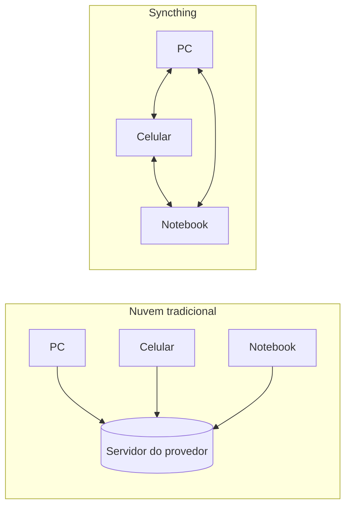

---
tags:
- syncthing
- documentacao
- sincronizacao
- open-source
---

# Syncthing: o que é e principais funcionalidades

> [!abstract] Resumo O **Syncthing** é um software **livre e de código aberto** para **sincronização contínua de arquivos entre dispositivos**. Não existe servidor central nem conta na nuvem: os dispositivos se comunicam diretamente (peer-to-peer) por um canal criptografado.

> [!quote] Em uma frase Você escolhe pastas, escolhe os dispositivos que devem ter essas pastas, e o Syncthing mantém tudo igual entre eles, sem intermediário.

Nota relacionada: [[4. Configuração avançada da interface gráfica]]

---

## Ficha técnica

|Item|Detalhe|
|---|---|
|Tipo|Sincronização contínua de arquivos (peer-to-peer)|
|Licença|MPL 2.0 (open source)|
|Linguagem|Go|
|Protocolo|BEP (Block Exchange Protocol) sobre TLS|
|Servidor central|Não há|
|Interface|Web (GUI no navegador) + API REST|
|Porta da GUI|`8384` (TCP)|
|Porta de sincronização|`22000` (TCP e UDP/QUIC)|
|Descoberta local|`21027` (UDP)|
|Plataformas|Linux, Windows, macOS, BSDs, Docker, Android (via fork)|

---

## Ideia central

Serviços como Dropbox, Google Drive e OneDrive guardam seus arquivos em servidores de um provedor. O Syncthing elimina esse intermediário:



> [!info] Consequência prática seus dados só existem nos dispositivos que você autorizou. Nenhum terceiro armazena ou tem acesso ao conteúdo.

---

## Como funciona por baixo

### Identidade de dispositivos (Device ID)

Na primeira execução, cada instalação gera um par de chaves e um certificado. O **Device ID** (sequência longa de letras e números, do tipo `XXXXXXX-XXXXXXX-...`) é derivado desse certificado.

- Para dois dispositivos se conectarem, **cada lado precisa aceitar explicitamente o ID do outro**.
- Isso funciona como **autenticação mútua**: ninguém entra na sua rede de sincronização sem sua aprovação.

![[indenti_disp.png]]
![[indenti_disp_pc.png]]
### Protocolo e criptografia

- A comunicação usa o **BEP (Block Exchange Protocol)** sobre **TLS**, com sigilo perfeito de encaminhamento.
- Os arquivos são divididos em **blocos** (de 128 KiB a 16 MiB, conforme o tamanho do arquivo), cada um identificado por hash SHA-256.
- Apenas os **blocos alterados** são transferidos, o que economiza banda em arquivos grandes que mudam pouco.

### Descoberta e conexão

|Mecanismo|Para que serve|
|---|---|
|**Descoberta local**|Broadcast/multicast na rede local (UDP 21027)|
|**Descoberta global**|Servidores públicos que só informam o endereço atual de um Device ID; não veem seus arquivos|
|**UPnP / NAT-PMP / STUN**|Abrir portas e atravessar NAT automaticamente|
|**Relays**|Último recurso quando não há conexão direta; o tráfego continua criptografado, então o relay não lê o conteúdo|

---

## Principais funcionalidades

### 1. Sincronização em tempo real

O monitor do sistema de arquivos detecta alterações quase instantaneamente. Varreduras periódicas funcionam como complemento.

### 2. Tipos de pasta

|Tipo|Comportamento|
|---|---|
|**Send & Receive**|Sincronização bidirecional|
|**Send Only**|O dispositivo só envia; alterações remotas não chegam nele|
|**Receive Only**|O dispositivo só recebe; alterações locais não são propagadas|
|**Receive Encrypted**|Guarda os dados **criptografados**, para dispositivos não confiáveis (ex.: um VPS); armazena, mas não lê o conteúdo|
![[sinc_tipo.jpeg]]
### 3. Versionamento de arquivos

Antes de um arquivo ser sobrescrito ou apagado por uma sincronização, o Syncthing pode guardar a versão antiga:

- **Trash Can**: lixeira com tempo de retenção.
- **Simple**: mantém N versões.
- **Staggered**: versões mais densas no passado recente e mais espaçadas no antigo.
- **External**: executa um comando seu.

![[Pasted image 20260923153636.png]]
### 4. Padrões de ignorar (`.stignore`)

Um arquivo de texto define o que **não** deve ser sincronizado, com sintaxe parecida com a do `.gitignore`.

```text
// Exemplo de .stignore
*.tmp
node_modules
.DS_Store
```

### 5. Tratamento de conflitos

Se o mesmo arquivo é editado em dois lugares antes de sincronizar, o Syncthing mantém a versão vencedora e salva a outra como:

```text
arquivo.sync-conflict-AAAAMMDD-HHMMSS-IDDISPOSITIVO.ext
```

> [!success] Nada é perdido silenciosamente. Você decide manualmente qual versão manter.

### 6. Introducers e aceitação automática

Um dispositivo pode ser marcado como _introducer_: ele apresenta automaticamente seus outros dispositivos conhecidos, o que facilita redes com muitos nós.

### 7. Interface web e API REST

- A administração é feita por uma **GUI no navegador**.
- A mesma funcionalidade fica exposta por **API REST**, autenticada por API Key, útil para scripts e integrações.
- Existe também um endpoint de métricas no formato **Prometheus**.

Detalhes das opções da GUI em [[4. Configuração avançada da interface gráfica]].

### 8. Multiplataforma

|Plataforma|Situação|
|---|---|
|Linux, Windows, macOS, BSDs|Suportados|
|Docker|Imagens oficiais|
|Linux (APT)|Repositório oficial|
|Android|App oficial **descontinuado** (último release em dezembro de 2024); alternativa mantida: **Syncthing-Fork** (F-Droid e GitHub)|
|iOS|Sem cliente oficial; existem apps de terceiros|

> [!warning] Android O app oficial foi descontinuado por causa da dificuldade de publicar na Play Store com a permissão de acesso a todos os arquivos e da falta de manutenção ativa. Quem usa Android costuma migrar para o Syncthing-Fork, e o processo de troca é feito por backup e restauração da configuração.

---

## Novidades das versões recentes

### Syncthing 2.0 (agosto de 2025)

- **Banco de dados:** LevelDB substituído por **SQLite**, com migração na primeira execução que pode demorar em instalações grandes.
- **Logs:** formato estruturado, níveis por pacote e novo nível `WARNING`.
- **Itens apagados:** deixam de ser guardados para sempre no banco e são esquecidos após **quinze meses** (configurável).
- **Linha de comando:** opções de traço simples (`-home`) não funcionam mais; use `--home`.
- **Conexões:** três conexões por padrão entre dispositivos v2 (uma para índice e duas para dados).
- **Pasta padrão:** não é mais criada na primeira inicialização.
- **Plataformas:** alguns sistemas deixaram de receber binários prontos (ex.: Windows ARM e vários BSDs), por causa do SQLite.
- **Conflitos:** uma exclusão pode agora ser a "vencedora", movendo o arquivo para uma cópia de conflito.

### Syncthing 2.1

- **Grupos** de dispositivos e pastas na GUI.
- Suporte a **proxies HTTP/HTTPS** com CONNECT, além de SOCKS.
- Possibilidade de **desligar a indexação de blocos** por pasta.
- **Duração de sessão** e caminho do cookie configuráveis (ver [[Syncthing - Configuração avançada da GUI#3. Sessão]]).

---

## Casos de uso comuns

- [x] Sincronizar um **vault do Obsidian** (ou qualquer pasta de notas) entre PC, notebook e celular.
- [x] **Backup** de fotos e documentos para um servidor doméstico ou NAS.
- [x] Manter **configurações e dotfiles** iguais entre máquinas.
- [x] Compartilhar pastas entre pessoas de confiança, sem depender de provedor.

> [!tip] Dica para vaults do Obsidian Arquivos como `.obsidian/workspace.json` mudam a cada uso e podem gerar conflitos entre dispositivos. Vale ignorá-los no `.stignore` da pasta.
> 
> ```text
> .obsidian/workspace.json
> .obsidian/workspace-mobile.json
> ```

---

## Limitações e cuidados

> [!danger] Não é backup por si só Se você apagar ou corromper um arquivo, isso também é sincronizado. Use **versionamento** e/ou pastas **Receive Only** para reduzir o risco.

- **Ambos os dispositivos precisam estar online ao mesmo tempo** para trocar dados, pois não há servidor guardando arquivos no meio do caminho. Um nó sempre ligado (servidor, NAS, Raspberry Pi) resolve isso.
- **Não há arquivos sob demanda** (como os _placeholders_ do OneDrive): cada dispositivo guarda uma cópia completa das pastas compartilhadas.
- **Não é para edição colaborativa simultânea** do mesmo arquivo.
- **Sem links de compartilhamento:** só compartilha com dispositivos que você adicionou.
- **Interface web exposta:** mantenha a GUI em `127.0.0.1` ou proteja com usuário, senha e TLS (ver [[4. Configuração avançada da interface gráfica]]).

---

## Comparação rápida

|Syncthing|Dropbox|Drive|Nextcloud|rsync|
|---|---|---|---|---|
|Servidor central|Não|Sim (do provedor)|Sim (seu)|Não|
|Contínuo / tempo real|Sim|Sim|Sim|Não (manual/cron)|
|Código aberto|Sim|Não|Sim|Sim|
|Criptografia ponta a ponta entre dispositivos|Sim|Não por padrão|Opcional|Via SSH|
|Interface gráfica|Sim (web)|Sim|Sim|Não|

---

## Glossário rápido

|Termo|Significado|
|---|---|
|**Device ID**|Identificador único do dispositivo, derivado do certificado|
|**Folder ID**|Identificador da pasta compartilhada|
|**BEP**|Block Exchange Protocol, protocolo de troca de blocos|
|**Introducer**|Dispositivo que apresenta outros dispositivos automaticamente|
|**Relay**|Servidor intermediário de tráfego criptografado, usado sem conexão direta|
|**Discovery**|Mecanismo para encontrar o endereço de um Device ID|
|**`.stignore`**|Arquivo com padrões de itens que não serão sincronizados|
|**Conflict copy**|Cópia `.sync-conflict-...` gerada quando há edições concorrentes|

---

## Referências

- [Site oficial do Syncthing](https://syncthing.net)
- [Documentação oficial](https://docs.syncthing.net/)
- [Syncthing: Configuration](https://docs.syncthing.net/users/config.html)
- [Syncthing: Prometheus-style metrics](https://docs.syncthing.net/users/metrics.html)
- [Syncthing: Releases (GitHub)](https://github.com/syncthing/syncthing/releases)
- [Syncthing-Fork para Android (GitHub)](https://github.com/Catfriend1/syncthing-android)